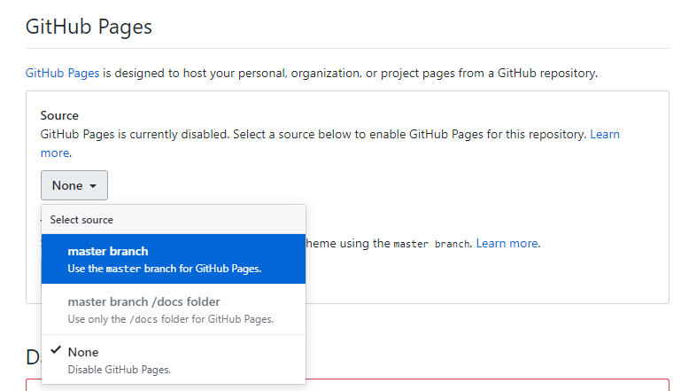

## Hugo的安装

前往[Hugo releases](https://github.com/gohugoio/hugo/releases)下载`hugo_xxx_Windows-64bit.zip`，解压后将路径添加到PATH。重启终端，运行
```bash
hugo version
```
如打印出版本号则Hugo安装成功

## Hugo搭建博客

### 1.创建新的项目
```bash
hugo new site 项目名
```

### 2.添加主题
```bash
cd 项目文件夹
git init
git submodule add https://github.com/budparr/gohugo-theme-ananke.git themes/ananke
echo 'theme = "ananke"' >> config.toml
```
如需修改主题，请访问[themes.gohugo.io](https://themes.gohugo.io/)

### 3.添加内容
```bash
hugo new 内容路径
```
例如：
```bash
hugo new posts/my-first-post.md
```
生成的文件默认带有以下内容：
```text
---
title: "My First Post"
date: 2019-03-26T08:47:11+01:00
draft: true //标记是否为草稿，打包前需确认要展示的文章的draft为false
---
```
### 4.启动Hugo server预览
```bash
hugo server -D
```
开启Hugo server后，访问给出的地址即可查看你的博客，默认为[http://localhost:1313/](http://localhost:1313/)

### 5.打包静态网页
```bash
hugo -D
```
打包后你的项目中会生成一个`public`文件夹，就是它了

## 使用Github发布你的博客
首先在创建Github上创建一个名为「你的Github用户名.github.io」的仓库，把打包后的`public`文件夹关联到这个仓库，推送内容后点开该仓库的`Settings`，找到`GitHub Pages`配置，把`Source`设置为`master branch`

之后便可通过[你的Github用户名.github.io]()来访问你的博客。


